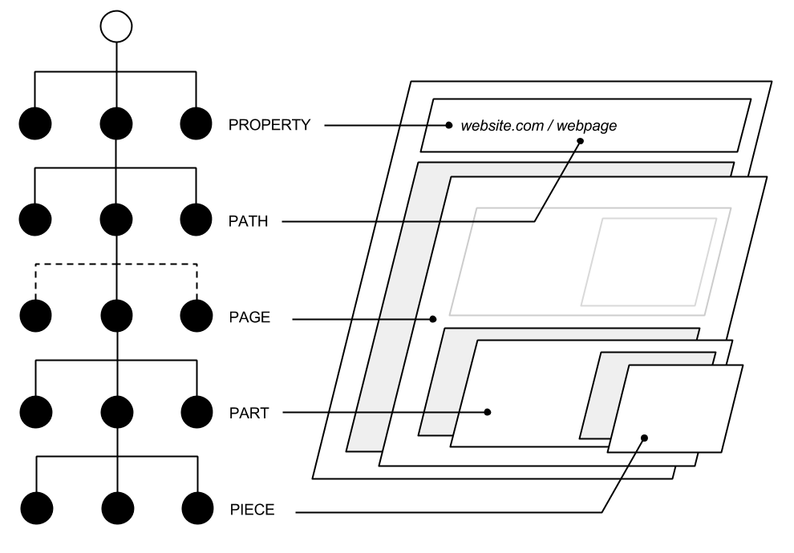

==================================================================
ARK
==================================================================

ARK is a pet project that I've been looking to build for over a decade. It is my attempt at building the content management system I always wanted and/or needed. A CMS that by nature is easy to understand and meets the technical, functional and design needs for all parties involved. 

.. _TOP:
.. contents:: Table of Contents
   :depth: 2

Architecture
------------
ARK is comprised of three "micro" applications. A clear separation of concerns between the content being stored, the interactive management of that content and it's presentation.

ARK.Tektonik
   A RESTful api service to the tektonik database. It is responsible for providing all create, read, update and delete methods for each of ARK's resource types aptly named ARK.Types.
ARK.Tekt
   A WYSIWYG site building tool which implements the ARK.Tektonik api. This is the tool people will view as their Content Management System.
ARK.Tekture
   A Theming Engine.

Types
-----
ARK organizes content into a simple predefined hierarchical set of types called ARK.Types. Like a tree, each type branches down to the lower types. There are five ARK.Types:

Property
   A ``Property`` is a domain name. Example: *www.website.com* or *my.website.com*

Path
   A ``Path`` is an "endpoint" sometimes called a slug. Example: */home* or */contact*. Paths point to pages. Paths can point to a single ``Page`` perpetually or schedule out a set pages based on date and time. This allows content managers to automate A/B testing, content postings, workflow, etc.

Page
   A ``Page`` is a configuration of ``Parts``. It should be viewed as a simple web page.

Part
  A ``Part`` is a configuration of ``Pieces`` and should be viewed as a part of a web page.There are built in ``Part`` types as well as a simple api for implementing custom part types. They can be as simple as a text block or more complex as you want to make them.

Piece
  A ``Piece`` is the actual content in the system. This includes all the text, images, documents, etc. 

Illustration
^^^^^^^^^^^^
The following diagram illustrates the ARK.Types hierarchy:

